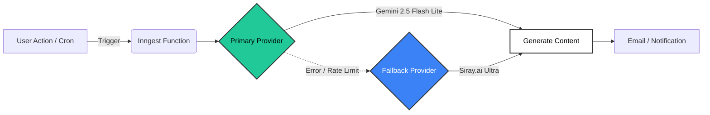

  
  <h1>OpenStock API & Architecture</h1>
  
  

    <b>Modern. Open. Resilient.</b>
  

  

    
    
    
  

---

## 🏗️ Architecture Overview

OpenStock leverages a resilient event-driven architecture powered by **Inngest**. We prioritize uptime for our generative features by utilizing a multi-provider AI strategy.

### 🧠 Intelligent Model Routing

We don't rely on a single point of failure. Our AI infrastructure automatically routes around outages.

---

## 🤝 AI Partners

### Primary: Google Gemini
The workhorse of our generative content. Fast, efficient, and deeply integrated via Inngest.

### Fallback: Siray.ai
> [!IMPORTANT]
> **Zero Downtime Guarantee.**
> When Gemini wavers, **Siray.ai** takes over instantly. No user request is ever dropped.

   
  
  
<i>The robust infrastructure backing OpenStock.</i>

---

## ⚡ Serverless Functions (Inngest)

Our background jobs are defined in `lib/inngest/functions.ts`.

| ID | Type | Schedule/Trigger | Purpose |
| :--- | :--- | :--- | :--- |
| `sign-up-email` | 🔔 Event | `app/user.created` | **Personalized Onboarding.** Generates a custom welcome message based on user quiz results. |
| `weekly-news-summary` | ⏱️ Cron | `0 9 * * 1` (Mon 9AM) | **Market Intelligence.** Summarizes top financial news and broadcasts to all users via Kit. |
| `check-stock-alerts` | ⏱️ Cron | `*/5 * * * *` | **Real-time Monitoring.** Checks user price targets against live market data. |
| `check-inactive-users` | ⏱️ Cron | `0 10 * * *` | **Re-engagement.** Identifies dormant users (>30 days) and sends a "We miss you" nudge. |

---

## 🔌 API Integrations

<b>📈 Stock Data: Finnhub</b>

 

*   **Base URL:** `https://finnhub.io/api/v1`
*   **Key Features:** Real-time quotes, technical indicators, market news.
*   **Auth:** `NEXT_PUBLIC_FINNHUB_API_KEY`

<b>📧 Email & Marketing: Kit (ConvertKit)</b>

 

*   **Role:** High-volume user broadcasts and tag management.
*   **Key Endpoints:**
    *   `POST /v3/tags/{tag_id}/subscribe` (User Migration)
    *   `POST /v3/broadcasts` (Newsletters)
*   **Auth:** `KIT_API_KEY` • `KIT_API_SECRET`

<b>🗄️ Database: MongoDB Atlas</b>

 

*   **Connection:** Standard URI (DNS SRV bypassed for maximum reliability).
*   **Collections:** `users`, `watchlists`, `alerts`.

---

  Documentation © Open Dev Society. Built with ❤️ for the Open Source Community.

